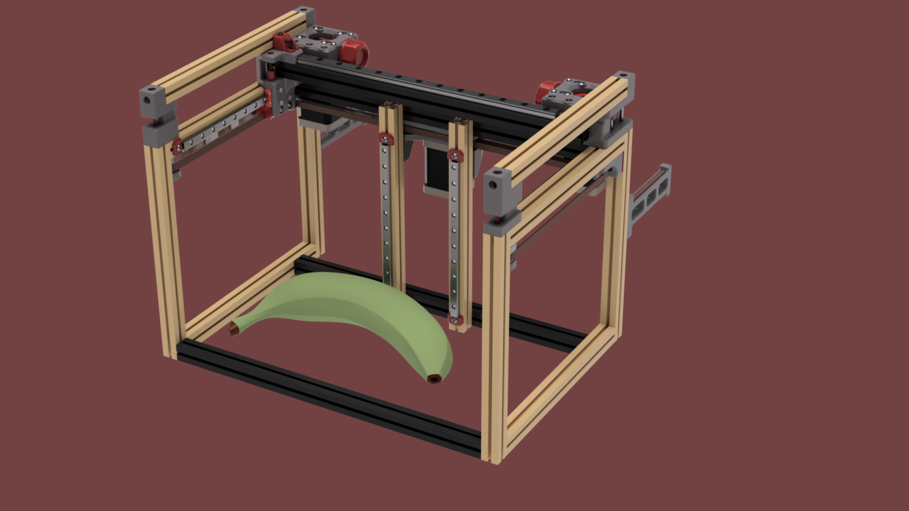
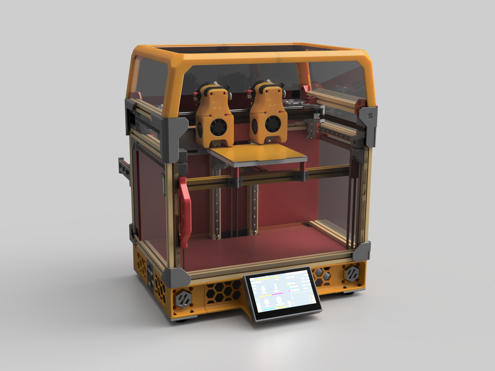
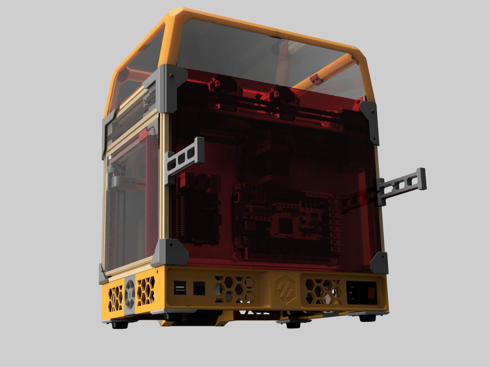
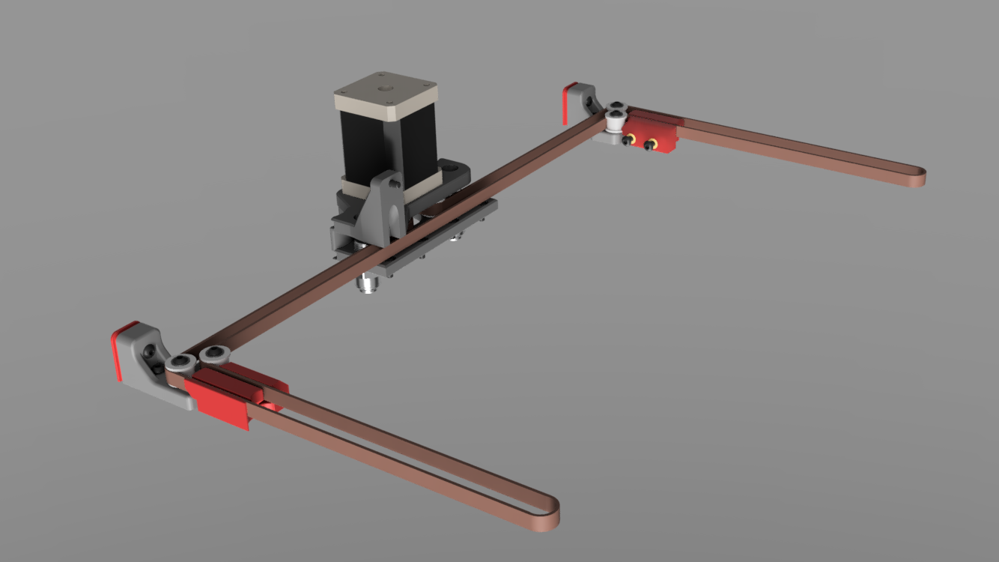
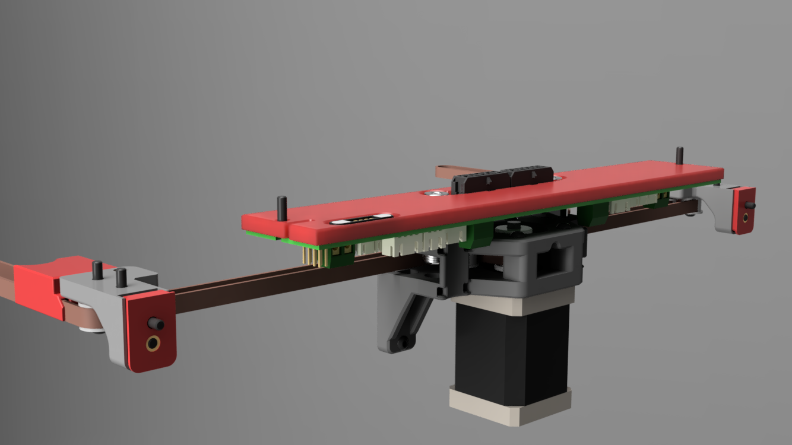
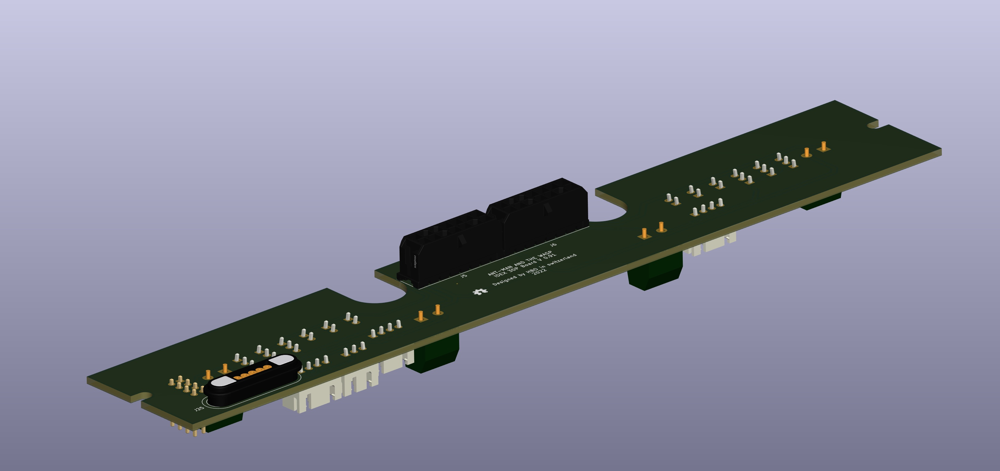
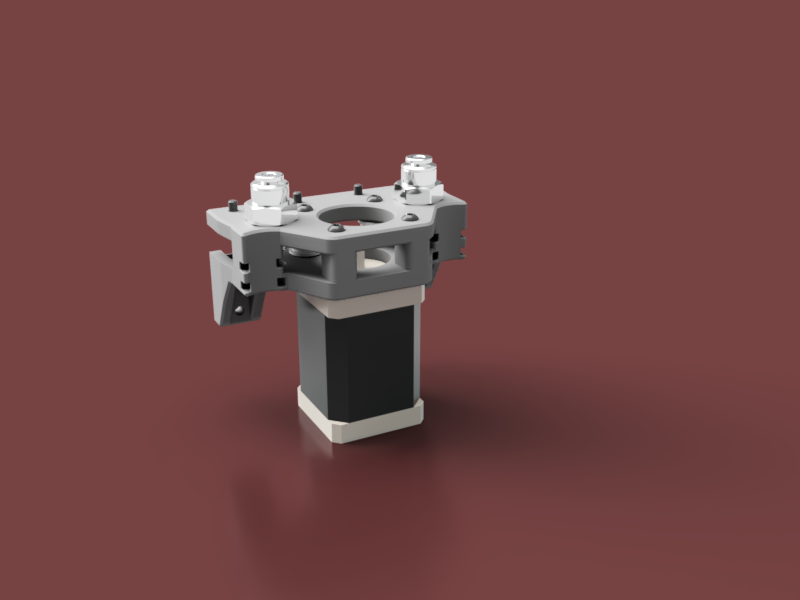
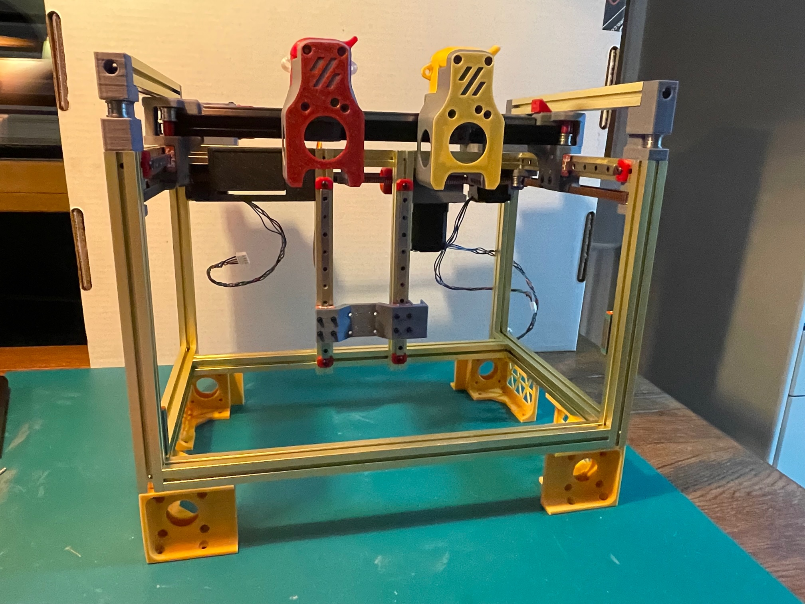
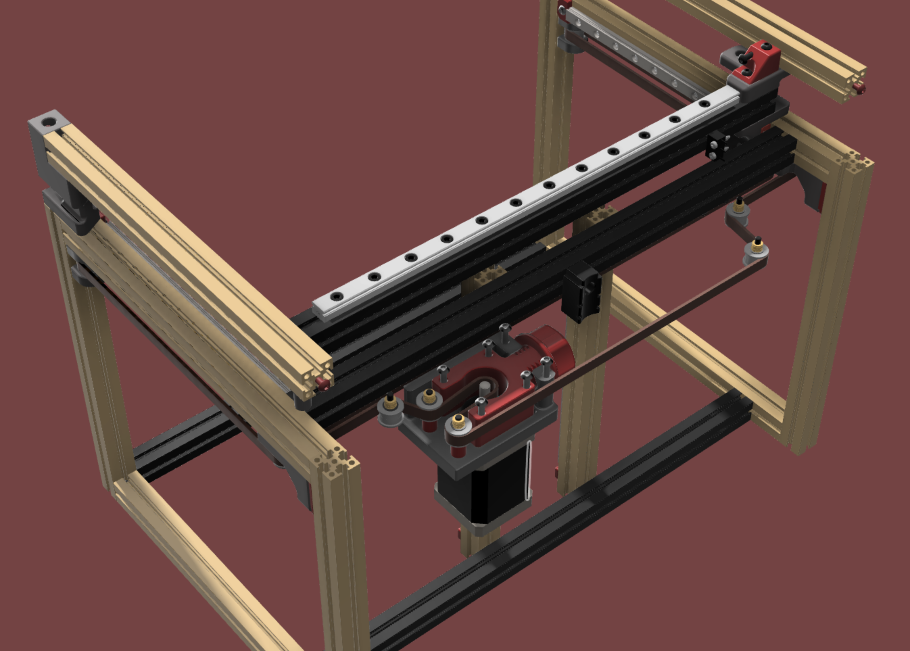

# Double Dragon - Single Y

This is a sigle Y version of the "Voron V0.1 Double Dragon IDEX" printer 

# Warning: perpetual beta ..

.. also known as the Banana Principle. 

The banana principle is a expression, expressing that this product is still immature and can mature with the consumer. 
It is based on the fact that bananas harvested unripe, green and delivered only after a maturation period during 
middlemen or even the end user are edible.

.. back to the printer

# Double Dragon Single Y - also called "Ant-Man and the Wasp" 

TODO: - add a list of benefits of the single Y vs two steppers (once we know all of them)

# The Wasp Alpha-3 2022-06-06

It's been a while since the last update.
But lots of progress since then.

* The latest ersion is in the Wasp Folder (The Fusion CAD Export)
* There are also a few "optional" PCB's designed for this printer
** The Topedck PCB that makes wireing a bit easier and notably cleaner
** A variation of the Pankake Board that add support for Neopixel LED's (A toolhaad with LED is in the making)

## Some Build notes:

A few parts have built in supports (some of the skirts). So generaly, there is no need for add supports on all the parts.
In most cases there are some 2 Versions included in the CAD one with and one without supports (if you prefer to let your slicer do the job)

Here are some renders off the actual design:

# Alpha-2 Release 2022-02-09

### Thinkgs are movving fast. While building the Alpha 1 prototype several conclusions poped up.

* There is no need for the stepper tensioners - other tentioning options are more than enough
* Eliminationg the stepper tensioner allows for a much simpler belt path - reducing the number of bearings and bearing blocks
* Mounting the stepper in the center provides more symetric friction - reducing the possibility of deracking
* Heaving a center mount provides the oportunity to eliminate cable mounts and bowden mounts as they can be integrated into the stepper mount

.. its not the end yet. There are more things to work on. 

* new back idlers without "deracking/tension" screws
* add tensioners to the belt mouns an the x gantry (well i'm not yet convinced about this)
* provide a simple tentioner in the center mount - no not back to the stepper tensioners ..

# Alpha-1 Release 2022-02-06

The goal of this version is to get away with a common Octopus or spider board that has only 7 steppers.
Second goal is to save costs and proviede an upgrade path from a standard V0 kit.

Ther is no BOM yet but to get an idea.

* The prototype is based o a standard kit. 
* I used an aditional frame set and boted the short extrusion to the loger extrusions unsing a 14mm set screw
(https://www.hpiracing.com/en/part/100554)
* This way I can keep the color scema.
* The gantry and Bed mount (i.e. mooving parts=) are than built with the regular extrusions from the kit.

Abvuoisly you need one more toolhead an the Y-stepper (same as A/B)

## Belt path

# Changelog:

Alpha 1  (Feb. 6 2022)

- First protoype
- STL's files released as used on the prototype
- Latest CAD files not published

Alpha 2 (Feb. 9 2022)

- new center stepper mount
- new belth path - eliminating 3 bearing stacks
- Alpha 1 stepper mount and bearing plate removed
- new belt clips as the belt is now flipped compared to Alpha 1
