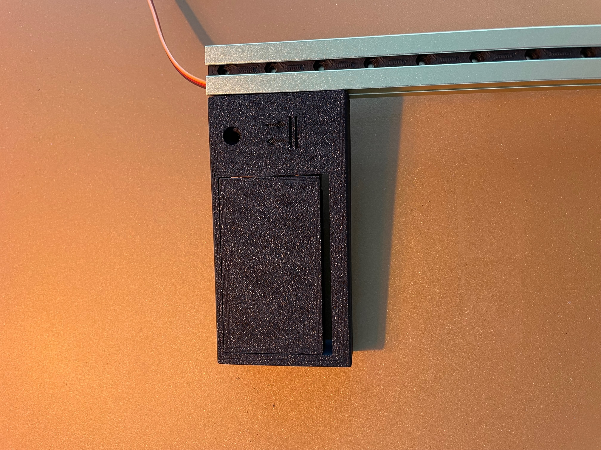
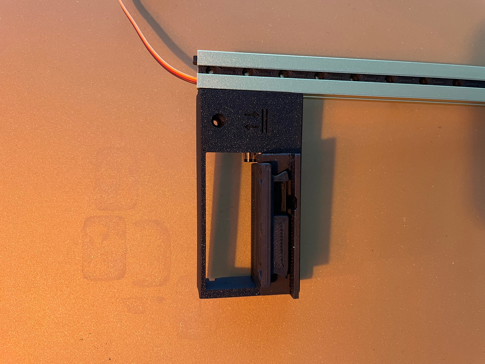
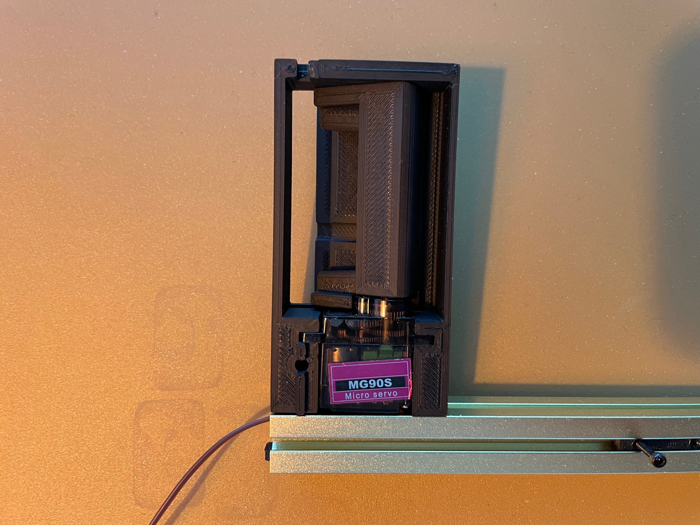
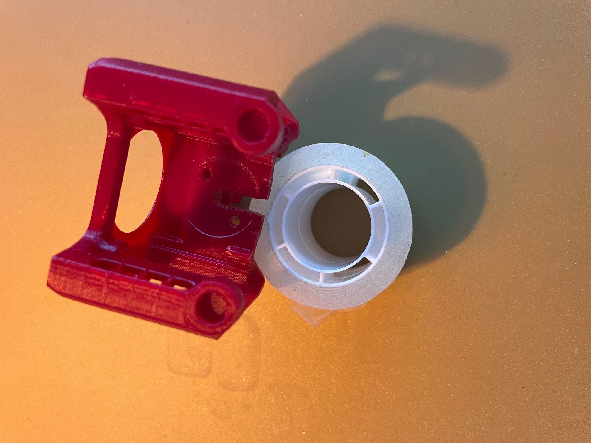

# X0 Servo Clicky

This is a clicky dock for the "Voron V0.1 Double Dragon IDEX" printer - or in short the "X0"

The actual release is pre alpha as i don't have a printer yet to test it out.
However the parts do print well with "standard" voron setting and fot together as intended.

Please see the pictures as reference.

